# 模式识别课程实验汇报

Bayes 分类器、线性判别、K-L 变换、图像识别与聚类分析

  
姓名：请填写

  
学号：请填写

  
班级：请填写

---

# 汇报思路

  
<b>实验一</b> Bayes 分类器

  
<b>实验二</b> 非参数估计与 Fisher

  
<b>实验三</b> K-L 特征提取

  
<b>实验四</b> K-L 图像识别应用

  
<b>实验五</b> 聚类分析

每个实验按照同一条主线展开：

```mermaid
flowchart LR
  A[课程理论] --> B[实验设置]
  B --> C[实现方法]
  C --> D[实验结果]
  D --> E[分析总结]
```

---

# 数据与实验环境

## 主要数据

| 数据集 | 用途 |
| --- | --- |
| FEMALE / MALE | 性别分类、特征提取、聚类 |
| test1 / test2 | 分类器泛化测试 |
| 飞机图像数据集 | K-L 图像识别应用 |

## 实验工具

| 工具 | 作用 |
| --- | --- |
| Python 3.11 | 实验主环境 |
| NumPy / SciPy | 数值计算 |
| scikit-learn | 评估、PCA、层次聚类辅助 |
| Matplotlib | 结果可视化 |

核心实验代码均已脚本化执行，输出包括指标 CSV、图像结果和 LaTeX 报告。

---
layout: section
---

# 实验一

用身高/体重数据建立 Bayes 性别分类器

---

# 实验一：课程理论

Bayes 分类器根据后验概率进行决策：

$$
\hat{\omega}=\arg\max_{\omega_i} P(\omega_i|\mathbf{x})
=\arg\max_{\omega_i} p(\mathbf{x}|\omega_i)P(\omega_i)
$$

在正态分布假设下：

$$
g_i(\mathbf{x})=-\frac{1}{2}\ln|\Sigma_i|
-\frac{1}{2}(\mathbf{x}-\mu_i)^T\Sigma_i^{-1}(\mathbf{x}-\mu_i)
+\ln P(\omega_i)
$$

  
<b>参数估计</b> 最大似然估计均值和协方差

  
<b>先验概率</b> 影响决策边界偏移

  
<b>最小风险</b> 用损失函数代替单纯错误率

---

# 实验一：实验设置与实现

## 设置

- 训练集：50 个女生、50 个男生
- 测试集：`test1` 35 个样本，`test2` 300 个样本
- 特征：身高、体重、身高+体重
- 先验：0.5/0.5、0.75/0.25、0.9/0.1
- 协方差：完整协方差、对角协方差

## 实现流程

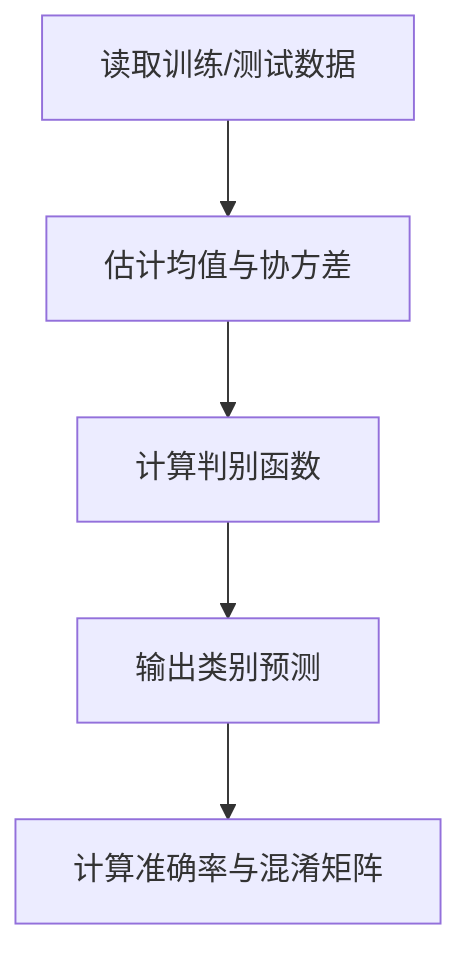
```mermaid
flowchart TD
  A[读取训练/测试数据] --> B[估计均值与协方差]
  B --> C[计算判别函数]
  C --> D[输出类别预测]
  D --> E[计算准确率与混淆矩阵]
```

---

# 实验一：数据分布与决策边界

  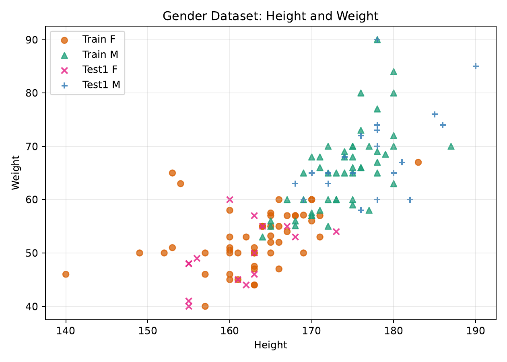
  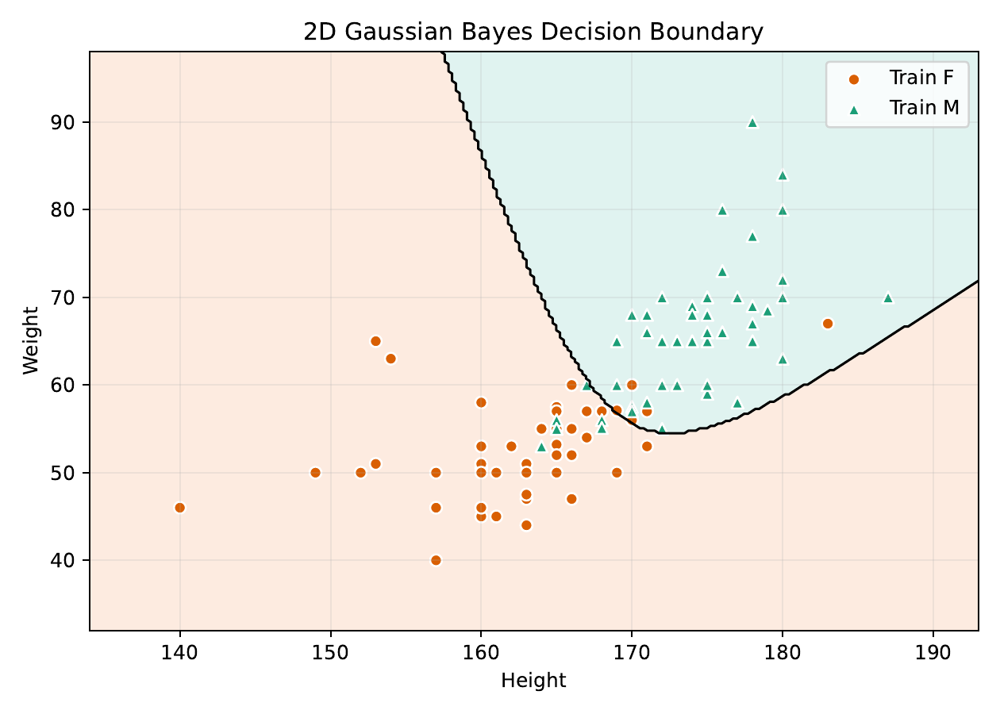

男生样本整体身高、体重更高，但边界区域存在重叠，因此无法做到完全无误分类。

---

# 实验一：结果与分析

| 方法 | 训练集 | test1 | test2 |
| --- | ---: | ---: | ---: |
| 二维 Bayes，完整协方差，等先验 | 88.00% | 97.14% | 89.33% |
| 二维 Bayes，对角协方差，等先验 | 88.00% | 97.14% | 90.33% |
| 最小风险 Bayes | 84.00% | 94.29% | 84.33% |
| Parzen Bayes | 87.00% | 97.14% | 90.33% |
| kNN，k=5 | 89.00% | 100.00% | 90.33% |

## 现象

- 两个特征整体优于单个特征
- 先验概率偏离测试集分布时，性能明显下降
- 非参数方法与参数 Bayes 表现接近

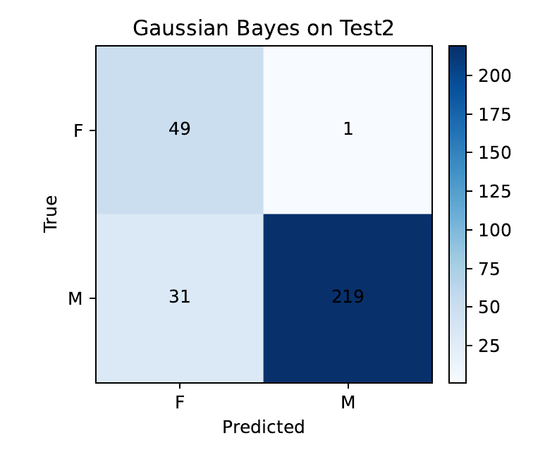

---
layout: section
---

# 实验二

非参数估计、Fisher 线性判别与留一法

---

# 实验二：课程理论

Parzen 窗估计不预设密度形式：

$$
\hat{p}(\mathbf{x}|\omega_i)=
\frac{1}{N_i}\sum_{k=1}^{N_i}
\frac{1}{(2\pi)^{d/2}h^d}
\exp\left(-\frac{\|\mathbf{x}-\mathbf{x}_k\|^2}{2h^2}\right)
$$

Fisher 线性判别寻找投影方向，使类间离散度相对类内离散度最大：

$$
J(\mathbf{w})=\frac{\mathbf{w}^TS_b\mathbf{w}}{\mathbf{w}^TS_w\mathbf{w}},
\quad
\mathbf{w}=S_w^{-1}(\mu_1-\mu_2)
$$

留一法用于在样本较少时估计泛化误差。

---

# 实验二：实验设置与实现

  
<b>Parzen Bayes</b> 高斯核，窗口宽度 h=5.0

  
<b>Fisher 判别</b> 同时使用身高和体重

  
<b>留一法</b> 每次留出一个训练样本验证

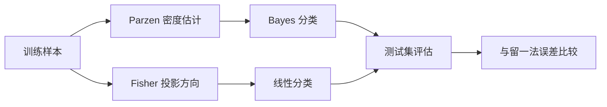
```mermaid
flowchart LR
  A[训练样本] --> B[Parzen 密度估计]
  A --> C[Fisher 投影方向]
  B --> D[Bayes 分类]
  C --> E[线性分类]
  D --> F[测试集评估]
  E --> F
  F --> G[与留一法误差比较]
```

---

# 实验二：决策边界与投影

  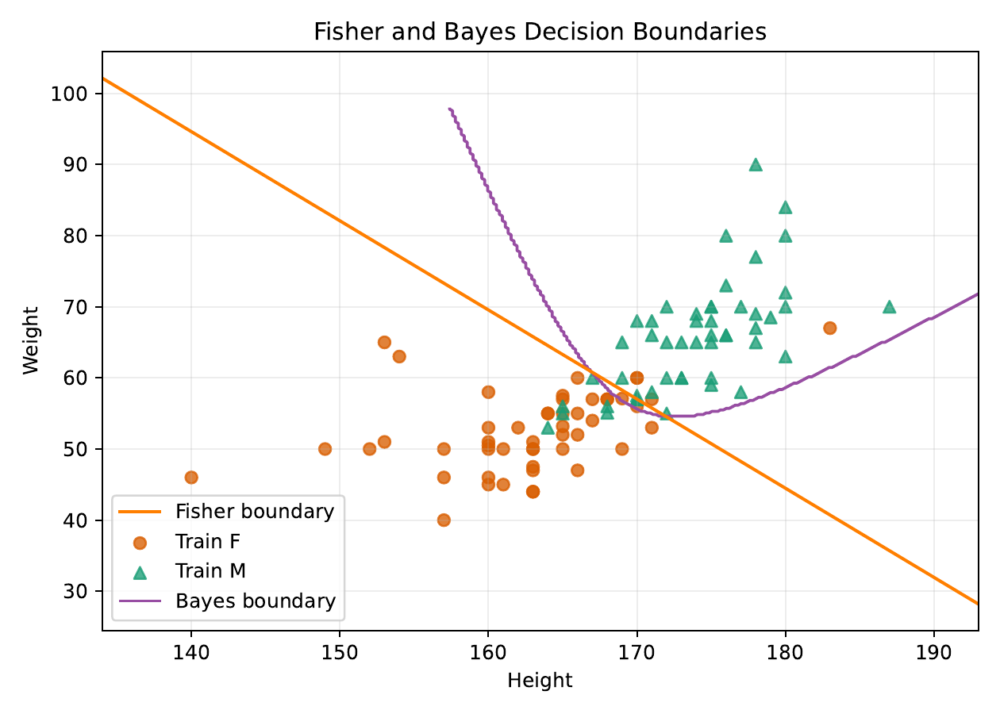
  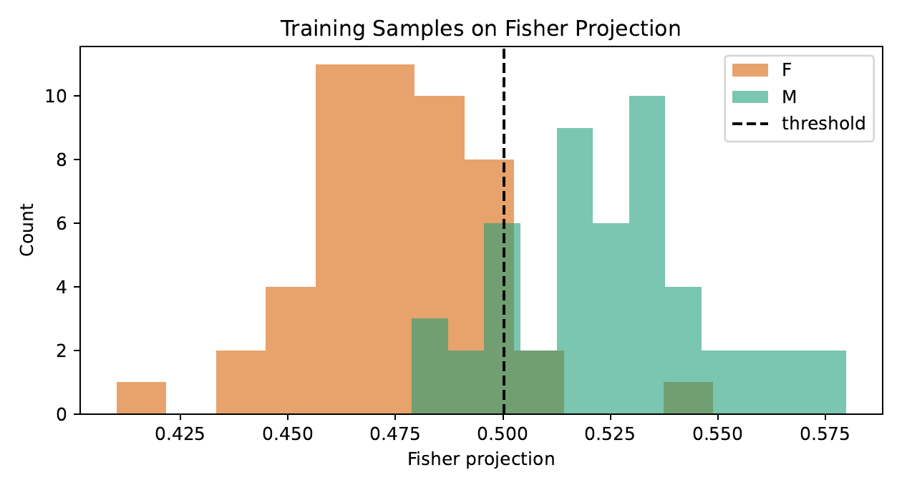

Bayes 边界可以是非线性的；Fisher 直接给出线性投影与阈值，解释性更强。

---

# 实验二：结果与分析

| 方法 | 训练错误率 | test1 错误率 | test2 错误率 | 留一法错误率 |
| --- | ---: | ---: | ---: | ---: |
| Gaussian Bayes | 12.00% | 2.86% | 10.67% | 12.00% |
| Parzen Bayes | 13.00% | 2.86% | 9.67% | 14.00% |
| Fisher | 12.00% | 2.86% | 9.67% | 13.00% |

## 分析

- Parzen 不依赖正态分布假设，但对窗口宽度敏感
- Fisher 不估计概率密度，直接优化线性可分性
- 留一法结果与 test2 更接近，说明其能较稳健地估计泛化误差

---
layout: section
---

# 实验三

K-L 变换进行特征提取

---

# 实验三：课程理论

K-L 变换即 PCA，从协方差矩阵的特征分解中寻找最大方差方向：

$$
\Sigma \mathbf{u}_i=\lambda_i \mathbf{u}_i
$$

投影形式为：

$$
z_i=\mathbf{u}_i^T(\mathbf{x}-\mu)
$$

<b>K-L / PCA</b> 
无监督，目标是保留数据总体方差。

<b>Fisher</b> 
有监督，目标是增强类别可分性。

---

# 实验三：实验设置与实现

## 设置

- 数据：FEMALE + MALE 共 100 个训练样本
- 特征：身高、体重
- 方法一：不考虑类别信息，做 PCA
- 方法二：利用类均值差方向投影
- 对比：Fisher 与 Gaussian Bayes

## 关键参数

| 项目 | 数值 |
| --- | --- |
| 第一主成分解释率 | 87.52% |
| PC1 | (0.6269, 0.7791) |
| 类均值方向 | (0.6514, 0.7587) |

---

# 实验三：投影方向与样本分布

  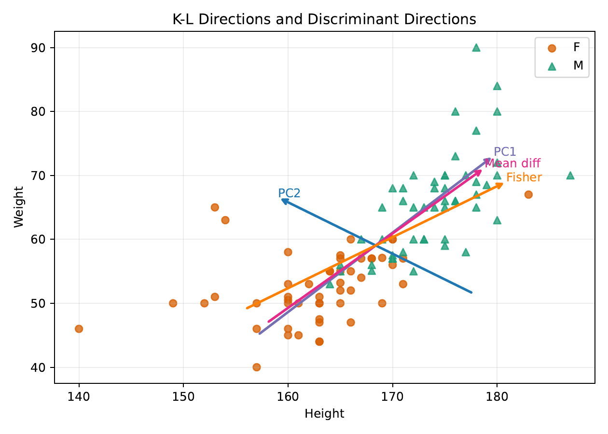
  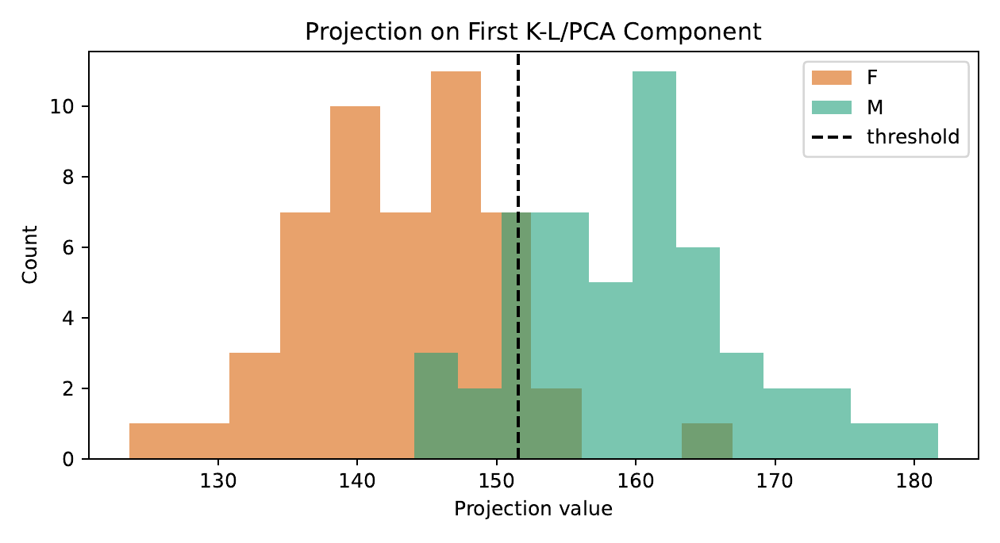

本数据中最大方差方向与性别差异方向比较接近，因此 PCA 一维投影也能取得较好分类效果。

---

# 实验三：结果与分析

| 方法 | 训练集 | test1 | test2 |
| --- | ---: | ---: | ---: |
| K-L PCA 第一主成分 | 86.00% | 100.00% | 89.67% |
| 类均值方向 | 86.00% | 100.00% | 89.67% |
| Fisher | 88.00% | 97.14% | 90.33% |
| Gaussian Bayes | 88.00% | 97.14% | 89.33% |

## 分析

- K-L 适合降维和特征提取，但不是专门为分类优化
- Fisher 使用类别标签，因此在 test2 上略优
- 当主方差方向与类别差异方向一致时，PCA 也可以获得较好分类效果

---
layout: section
---

# 实验四

K-L 变换在飞机图像识别中的应用

---

# 实验四：课程理论

图像可以看作高维向量。K-L 变换在图像识别中的典型思想是：

```mermaid
flowchart LR
  A[图像矩阵] --> B[灰度化/缩放]
  B --> C[展开为高维向量]
  C --> D[PCA 提取低维特征]
  D --> E[分类器识别]
```

与“特征脸”类似，本实验学习的是飞机图像的主要变化方向。

$$
\mathbf{z}=U_k^T(\mathbf{x}-\mu)
$$

---

# 实验四：实验设置与实现

## 数据与预处理

- 数据集：飞机分类图像
- 类别数：16 类
- 训练集：2530 张
- 测试集：636 张
- 预处理：灰度化、缩放到 32×32、展开为 1024 维向量

## 模型设置

- 标准化后进行 PCA
- 主成分数：8、16、32、64、128
- 分类器：Nearest Centroid 与 1NN
- 主结果：64 维 PCA + 1NN

---

# 实验四：样本与主成分

  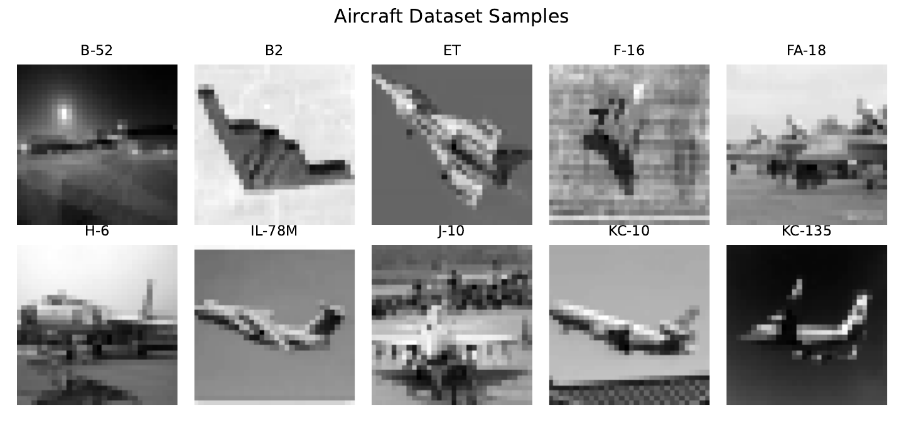
  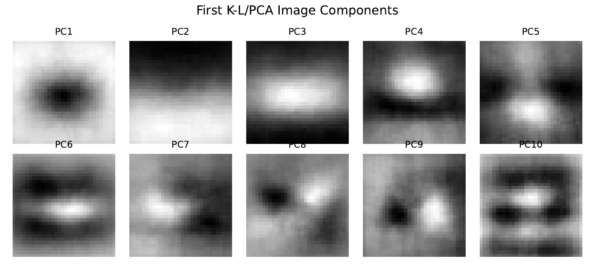

64 个主成分保留约 89.88% 的训练集方差信息，将 1024 维图像压缩到 64 维。

---

# 实验四：结果与分析

| 方法 | 主成分数 | 训练集 | 测试集 |
| --- | ---: | ---: | ---: |
| PCA+NearestCentroid | 64 | 20.47% | 19.97% |
| PCA+1NN | 32 | 100.00% | 54.09% |
| PCA+1NN | 64 | 100.00% | 53.93% |
| PCA+1NN | 128 | 100.00% | 52.99% |

## 分析

- 1NN 明显优于最近质心，说明类内变化较复杂
- 主成分过多后，背景和噪声也会被保留
- PCA 是有效特征压缩方法，但单独使用不足以完成高精度图像分类

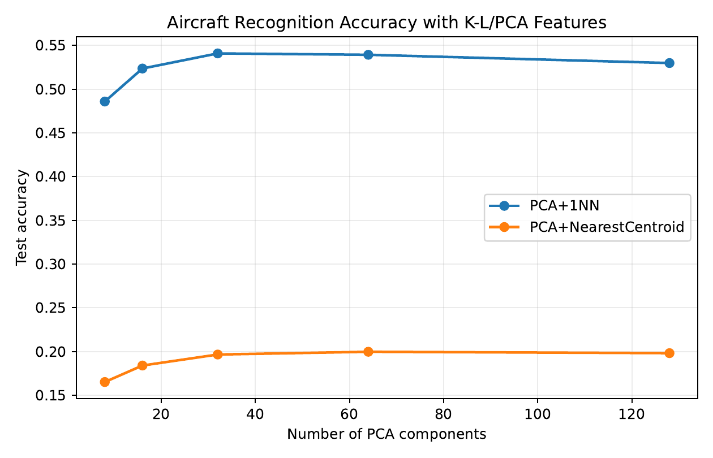

---

# 实验四：混淆矩阵观察

  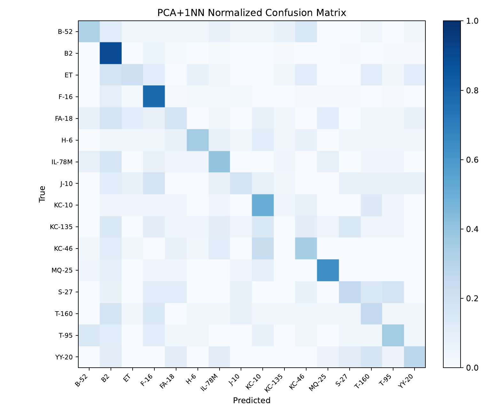
  

    <h2>主要现象</h2>
    <ul>
      <li>部分飞机类别外形相近，在低分辨率灰度图中容易混淆</li>
      <li>姿态、背景、拍摄尺度会进入 PCA 主成分</li>
      <li>后续可结合 HOG/SIFT/ORB 或 CNN 提升识别能力</li>
    </ul>
  

---
layout: section
---

# 实验五

C 均值与分级聚类分析

---

# 实验五：课程理论

C 均值聚类即 k-means，通过迭代最小化类内平方误差：

$$
J=\sum_{j=1}^{C}\sum_{\mathbf{x}_i\in \omega_j}
\|\mathbf{x}_i-\mu_j\|^2
$$

迭代步骤：

```mermaid
flowchart LR
  A[初始化中心] --> B[按距离分配样本]
  B --> C[更新聚类中心]
  C --> D{是否收敛}
  D -- 否 --> B
  D -- 是 --> E[输出聚类结果]
```

分级聚类则通过样本间距离形成层次结构，可用树状图观察聚类关系。

---

# 实验五：实验设置与实现

## 数据设置

- 数据一：FEMALE + MALE，共 100 个样本
- 数据二：训练集 + test2，共 400 个样本
- 特征：身高、体重
- 预处理：标准化

## 方法设置

- C 均值：独立编程实现
- 类别数：2、3、4、5
- 初始值：多随机种子比较
- 分级聚类：Ward 方法

---

# 实验五：C 均值聚类结果

  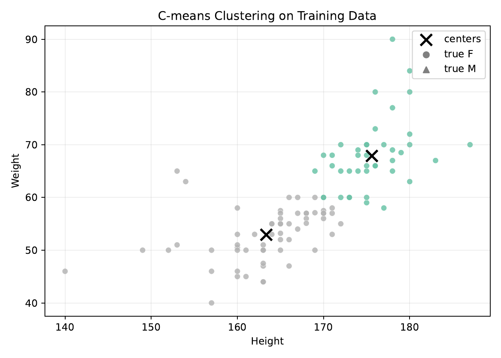
  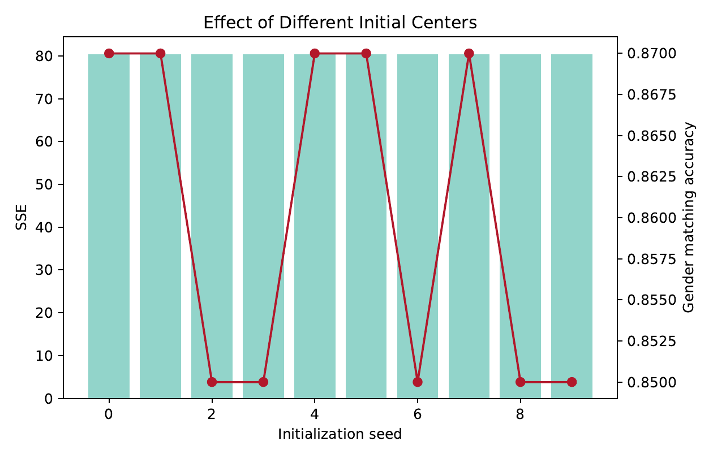

训练集取 C=2 时，与真实性别标签的最佳匹配率约为 85.00%；不同初始值下约在 85.00% 到 87.00% 之间波动。

---

# 实验五：类别数选择与分级聚类

  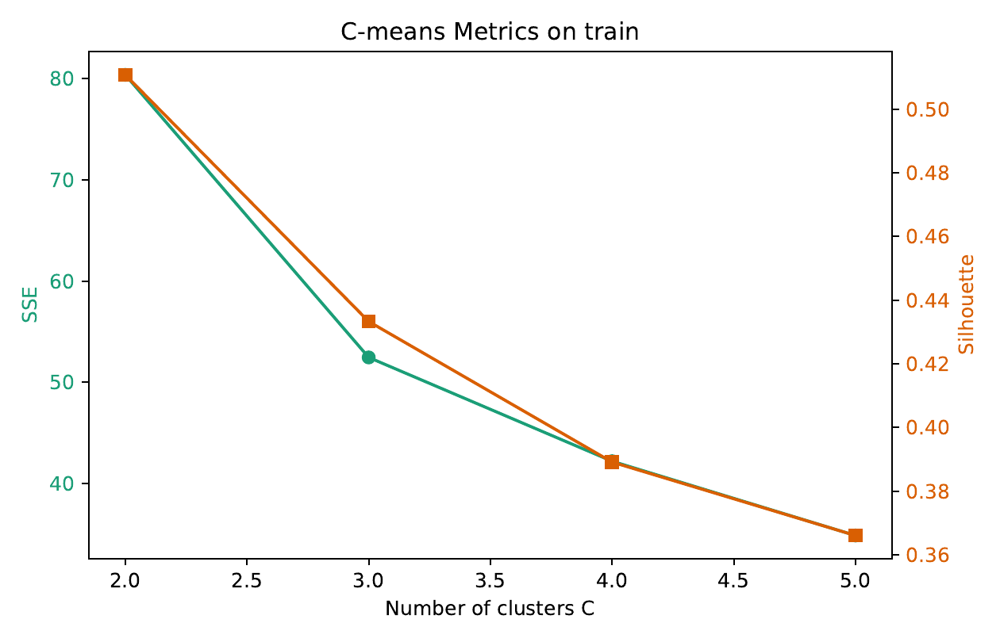
  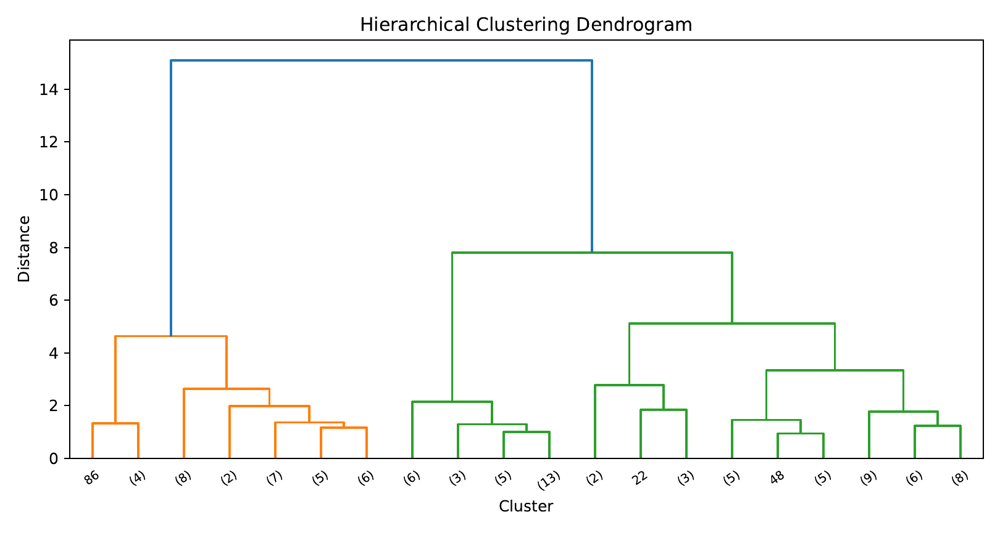

<b>C 均值，训练集 C=2</b> 
轮廓系数 0.5108，ARI 0.4850，性别匹配率 85.00%

<b>Ward 分级聚类，训练集 2 类</b> 
轮廓系数 0.5049，ARI 0.3789，性别匹配率 81.00%

---

# 实验五：加入 test2 后的变化

  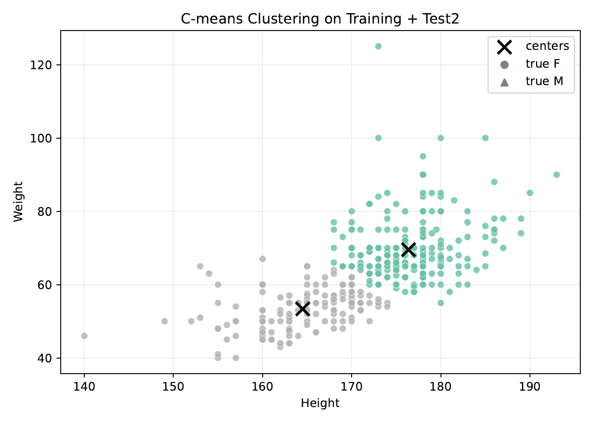
  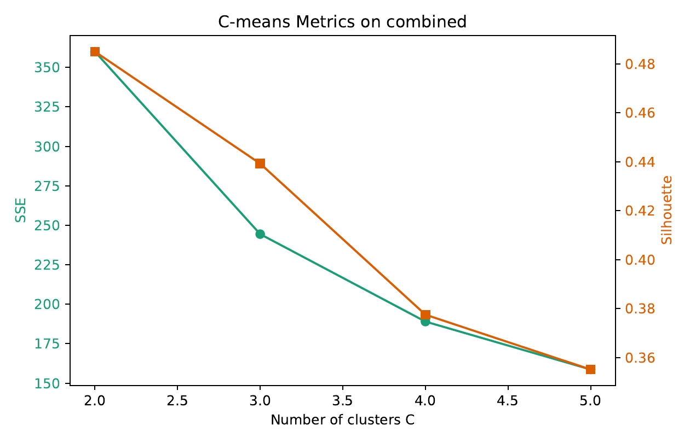

加入 test2 后样本变为 400 个，男生比例更高；C=2 的匹配率为 84.50%，整体结构仍然支持两类划分，但边界样本更多。

---

# 实验五：分析总结

| 数据 | 方法 | 轮廓系数 | ARI | 性别匹配率 |
| --- | --- | ---: | ---: | ---: |
| 训练集 | C 均值，2 类 | 0.5108 | 0.4850 | 85.00% |
| 训练集 | Ward，2 类 | 0.5049 | 0.3789 | 81.00% |
| 训练集+test2 | C 均值，2 类 | 0.4850 | 0.4693 | 84.50% |
| 训练集+test2 | Ward，2 类 | 0.4739 | 0.4172 | 82.50% |

## 体会

- 聚类不使用标签，但能发现与性别相关的自然分组
- C 均值需要指定类别数，对初始化和特征尺度敏感
- 分级聚类更适合观察层次关系，但大样本计算成本更高

---

# 五个实验的横向关系

| 实验 | 课程知识点 | 监督信息 | 主要目标 |
| --- | --- | --- | --- |
| Bayes 分类 | 后验概率、参数估计、风险决策 | 使用标签 | 最小错误率或最小风险 |
| Fisher / Parzen | 非参数估计、线性判别、留一法 | 使用标签 | 比较概率模型与直接判别 |
| K-L 特征提取 | PCA、协方差特征分解 | 可不使用标签 | 降维与主方向分析 |
| K-L 图像应用 | 高维图像特征压缩 | 使用标签做识别 | 验证 PCA 在图像识别中的作用 |
| 聚类分析 | C 均值、分级聚类 | 不使用标签 | 发现样本自然结构 |

---

# 总体结论

## 实验认识

- 特征选择会直接影响分类器性能
- 先验概率和损失函数体现任务背景
- 非参数方法灵活，但依赖样本和超参数
- K-L 适合降维，不一定最适合分类
- 聚类能揭示结构，但解释需要结合真实标签

## 课程联系

- 从概率决策到线性判别
- 从监督分类到无监督聚类
- 从低维特征到高维图像识别
- 从训练误差到泛化性能评估

核心体会：模式识别方法没有绝对最优，算法选择必须结合数据分布、任务目标和评价指标。

---
layout: end
---

# 谢谢

欢迎老师和同学批评指正

